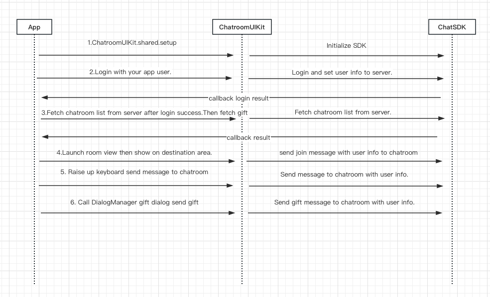

# ChatroomUIKit

*English | [中文](README.md)*

# [Sample demo](./app)

In this project, there is a best practice demonstration project in the `app` folder for you to build your own business capabilities.

To experience functions of the ChatroomUIKit, you can scan the following QR code to try a demo.

[](./image/demo.png).

# [ChatroomUIKit Guide](./README_EN.md#chatroomuikit-guide)

## [Introduction](./README_EN.md#introduction)

This guide presents an overview and usage examples of the ChatroomUIKit framework in Android development, and describes various components and features of this UIKit, enabling developers to have a good understanding of the UIKit and make effective use of it.

## [Important Features](./README_EN.md#important-features)

### [General Features](./README_EN.md#general-features)
- Send messages
- Messages timestamp
- Global broadcasting
- Unread message counts
- Gift
- Dark mode

### [Message Extensions](./README_EN.md#message-extensions)
- Report
- Translate
- Mute
- Recall

### [Member Management](./README_EN.md#member-management)
- Participant list
- Search participants
- Mute&Muted list
- Remove participants

## [Table of Contents](./README_EN.md#table-of-contents)

- [Requirements](./README_EN.md#requirements)
- [Installation](./README_EN.md#installation)
- [Structure](./README_EN.md#structure)
- [Quick Start](./README_EN.md#quick-start)
- [Advanced Usage](./README_EN.md#advanced-usage)
- [Customization](./README_EN.md#customization)
- [Business Flowchart](./README_EN.md#business-flowchart)
- [API Sequence Diagram](./README_EN.md#api-sequence-diagram)
- [Design Guidelines](./README_EN.md#design-guidelines)
- [Contributing](./README_EN.md#contributing)
- [License](./README_EN.md#license)

# [Requirements](./README_EN.md#requirements)

- Jetpack Compose that requires minimum Android API 21 (Android 5.0)
- Android Studio Arctic Fox 2020.3.1 or higher
- Use kotlin language
- JDK 1.8 or higher
- Gradle 7.0.0 or higher

# [Installation](./README_EN.md#installation)

You can use build.gradle to import the ChatroomUIKit library as a dependency for app projects.

## [Local module dependencies](./README_EN.md#Local-module-dependencies)

Locate the downloaded **ChatroomUIKit** module to import [ChatroomUIKit](./ChatroomUIKit) and [ChatroomService](./ChatroomService) modules to the project.

1. Open your project in Android Studio.

2. Choose **File** > **import Module**.

3. Search for **ChatroomUIKit** and select it.

```
// settings.gradle
include ':ChatroomUIKit'
include ':ChatroomService'
project(':ChatroomUIKit').projectDir = new File('../ChatroomUIKit/ChatroomUIKit')
project(':ChatroomService').projectDir = new File('../ChatroomUIKit/ChatroomService')

// app/build.gradle
dependencies {
  implementation(project(mapOf("path" to ":ChatroomUIKit")))
}
```

## [Remote module dependencies](./README_EN.md#remote-module-dependencies)

Add the following code line to build.gradle:

```
implementation 'io.hyphenate:ease-chatroomui-kit:1.0.0'
```

# [Structure](./README_EN.md#structure)

### [Basic components of ChatroomUIKit](./README_EN.md#basic-components-of-chatroomuikit)

```
┌─ Example                               // Sample demo directory
│  ├─ ChatroomListActivity               // Mainly providing room list Activity.
│  ├─ ChatroomActivity                   // Displaying ChatroomUIKit chatroom Activity.
│  ├─ compose                            // Sample demo.
│  ├─ http                               // Encapsulated network requests for interaction with app services.
│  └─ SplashActivity                     // Program launch page.
├─ ChatroomService                       // ChatroomUIKit protocol module.
│  ├─ model                              // The entity objects used by ChatroomUIKit (user, room information, and configuration information).
│  ├─ service                            // The protocols and protocol implementations used by ChatroomUIKit (room protocol, user protocol, and gift protocol).
│  │    └─ Protocol                        
│  │         ├─ GiftService              // Gift sending and receiving channel.
│  │         ├─ UserService              // Component for user login and user attribute update.
│  │         └─ ChatroomService          // Component for implementing the protocol for chat room management, including joining and leaving the chat room and sending and receiving messages.
│  └─ ChatroomUIKitClient                // ChatroomUIKit initialization class.
└─ ChatroomUIKit            
       ├─ compose                        // UI Compose (Bottom toolbar, message list, gift list, and bottom drawer).
       ├─ theme                          // Resource files providing properties such as colors, fonts, themes, gradients, and sizes required for the project.  
       ├─ viewModel                      // Data processing.
       ├─ widget                         // Input widget.
       └─ ui                             // Search Activity. 
```
# [Quick start](./README_EN.md#quick-start)

This guide provides several usage examples for different ChatroomUIKit components. Refer to the `app` folder for detailed code snippets and projects showing various use cases.

Refer to the following steps to run the Android platform application in Android Studio:

1. Download the demo to the local file.
2. Configure `CHATROOM_APP_KEY` and `REQUEST_HOST` in the `local.properties` folder in the root directory.
3. Run the demo.

### [Step 1: Initialize ChatroomUIKit](./README_EN.md#step-1-initialize-chatroomuikit)

```kotlin
class ChatroomApplication : Application() {
    override fun onCreate() {

        val chatroomUIKitOptions = ChatroomUIKitOptions(
            uiOptions = UiOptions(
                targetLanguageList = listOf(GlobalConfig.targetLanguage.code),
                useGiftsInList = false,
            )
        )

        ChatroomUIKitClient.getInstance().setUp(
            applicationContext = this,
            options = chatroomUIKitOptions,
            appKey = BuildConfig.CHATROOM_APP_KEY
        )
    }
}
```

### [Step 2: Log in to the ChatroomUIKit](./README_EN.md#step-2-log-in-to-the-chatroomuikit)

```kotlin
// Log in to the ChatroomUIKit with the user information of the current user object that conforms to the `UserInfoProtocol` protocol.
// The token needs to be obtained from your app server. You can also log in with a temporary token generated on the Agora Console.
// To generate a user and a temporary user token on the Agora Console, see https://docs.agora.io/en/agora-chat/get-started/enable?platform=android#manage-users-and-generate-tokens.
ChatroomUIKitClient.getInstance().login("user id","token")
```

### [Step 3: Create chat room](./README_EN.md#step-3-create-chat-room)

```kotlin
// 1. Get a chat room list and join a chat room. Alternatively, create a chat room on the Agora Console.
// 2. Load ComposeChatroom with setContent in activity. ComposeChatroom is a fully packaged chatroom scenario component. 
// 3. Set the parameters required for ComposeChatroom.
// 4. Add users to the chat room on the Console.
// Choose Project Management > Operation Management > Chat Room. Select View Chat Room Members in the Action column of a chat room and add users to the chat room in the displayed dialog box.  
// 5. Load the ComposeChatroom view and pass in the roomId and the UserEntity object of the room owner.
class ChatroomActivity : ComponentActivity(){
    override fun onCreate(savedInstanceState: Bundle?) {
        super.onCreate(savedInstanceState)
        setContent {
            ComposeChatroom(roomId = roomId,roomOwner = ownerInfo)
        }
    }
}
```

[](./image/CreateChatroomA.png).

# [Advanced Usage](./README_EN.md#advanced-usage)

Here are three examples of advanced usage.

### [1.Initialize the chat room compose](./README_EN.md#1initialize-the-chat-room-compose)

```kotlin
    val chatroomUIKitOptions = ChatroomUIKitOptions(
    chatOptions = ChatSDKOptions(),
    uiOptions = UiOptions(
        targetLanguageList = listOf(GlobalConfig.targetLanguage.code),
        useGiftsInList = false,
    )
)

ChatroomUIKitClient.getInstance().setUp(applicationContext = applicationContext,appKey = "Your AppKey",options = chatroomUIKitOptions)
```

### [2.Log in to ChatroomUIKit](./README_EN.md#2log-in-to-chatroomuikit)

```kotlin
class YourAppUser: UserInfoProtocol {
    var userId: String = "your application user id"

    var nickName: String = "you user nick name"

    var avatarURL: String = "you user avatar url"

    var gender: Int = 1

    var identity: String =  "you user level symbol url"

}
// Use the user information of the current user object that conforms to the UserInfoProtocol protocol to log in to ChatroomUIKit.
// You need to get a user token from your app server. Alternatively, you can use a temporary token. To generate a temporary token, visit https://docs.agora.io/en/agora-chat/get-started/enable?platform=android#generate-a-user-token.
ChatroomUIKitClient.getInstance().login(YourAppUser, token, onSuccess = {}, onError = {code,error ->})
```

### [3.Listen for ChatroomUIKit events and errors](./README_EN.md#3listen-for-chatroomuikit-events-and-errors)

You can call the `registerRoomResultListener` method to listen for ChatroomUIKit events and errors.

```kotlin
ChatroomUIKitClient.getInstance().registerRoomResultListener(this)
```

# [Customization](./README_EN.md#customization)

### [Modify configurable items](./README_EN.md#modify-configurable-items)

```kotlin
// Modify a configurable item in UiOptions. For example, you can configure useGiftsInList in UiOptions to determine whether gifts are displayed in the message list. 
val chatroomUIKitOptions = ChatroomUIKitOptions(
      uiOptions = UiOptions(
      targetLanguageList = listOf(GlobalConfig.targetLanguage.code),
      useGiftsInList = false,
    )
)

// Modify a configurable item in ViewModel. For example, you can modify configuration items in MessageListViewModel to determine whether to display the time and avatar.
class MessageListViewModel(
  private val isDarkTheme: Boolean? = false,
  private val showDateSeparators: Boolean = true,
  private val showLabel: Boolean = true,
  private val showAvatar: Boolean = true,
  private val roomId: String,
  private val chatService: UIChatroomService,
  private val composeChatListController: ComposeChatListController
)
```

### [Customize the theme](./README_EN.md#customize-the-theme)

You can update the theme-related configurable items to customize the theme. If no configurable item is modified, you can use the default theme.

```kotlin
@Composable
fun ChatroomUIKitTheme(
    isDarkTheme: Boolean = isSystemInDarkTheme(),
    colors: UIColors = if (!isDarkTheme) UIColors.defaultColors() else UIColors.defaultDarkColors(),
    shapes: UIShapes = UIShapes.defaultShapes(),
    dimens: UIDimens = UIDimens.defaultDimens(),
    typography: UITypography = UITypography.defaultTypography(),
    content: @Composable () -> Unit
)
```

# [Business Flowchart](./README_EN.md#business-flowchart)

The following figure presents the entire logic of business requests and callbacks.


# [API Sequence Diagram](./README_EN.md#api-sequence-diagram)

The following figure is the best-practice API calling sequence diagram in the `app` project.



# [Design Guidelines](./README_EN.md#design-guidelines)

For any questions about design guidelines and details, you can add comments to the Figma design draft and mention our designer Stevie Jiang.

See the [UI design drawing](https://www.figma.com/community/file/1322495388317476706/chatroom-uikit).

See the [UI design guidelines](https://docs-im-beta.easemob.com/uikit/chatroomuikit/android/design_guide.html)

# [Contributing](./README_EN.md#contributing)

Contributions and feedback are welcome! For any issues or improvement suggestions, you can open an issue or submit a pull request.

## [Author](./README_EN.md#author)

apex-wang, [1746807718@qq.com](mailto:1746807718@qq.com)

## [License](./README_EN.md#license)

ChatroomUIKit is available under the MIT license. See the LICENSE file for more information.
